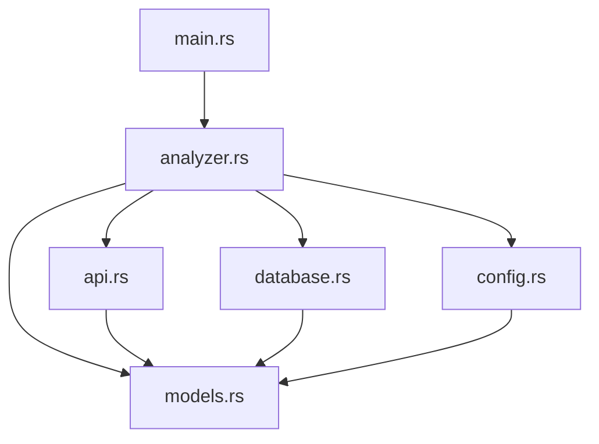

# 📁 项目结构详解

## 🏗️ 整体架构

本项目采用模块化设计，遵循 Rust 最佳实践，实现了高内聚、低耦合的代码结构。每个模块都有明确的职责，便于维护和扩展。

```
anki-creator/
├── 📁 src/                    # 源代码目录
│   ├── 📄 lib.rs              # 库入口，导出公共接口
│   ├── 📄 main.rs             # 主程序入口，用户界面
│   ├── 📄 config.rs           # 配置管理模块
│   ├── 📄 models.rs           # 数据结构定义
│   ├── 📄 api.rs              # API 客户端模块
│   ├── 📄 database.rs         # 数据库操作模块
│   └── 📄 analyzer.rs         # 核心分析逻辑模块
├── 📁 target/                 # 编译输出目录
├── 📄 Cargo.toml              # 项目配置和依赖
├── 📄 Cargo.lock              # 依赖版本锁定
├── 📄 config.toml             # 运行时配置文件
├── 📄 config.example          # 配置文件模板
├── 📄 input.txt               # 输入文本文件
├── 📄 japanese_words.csv      # 单词卡片输出
├── 📄 japanese_grammar.csv    # 语法卡片输出
├── 📄 anki_cards.db           # SQLite 数据库
├── 📄 README.md               # 项目说明文档
├── 📄 PROJECT_STRUCTURE.md    # 项目结构说明（本文件）
└── 📄 example.sh              # 使用示例脚本
```

## 🔧 模块详解

### 📄 lib.rs - 库入口
**职责**：定义库的公共接口，导出其他模块的功能

```rust
pub mod config;
pub mod models;
pub mod api;
pub mod database;
pub mod analyzer;

pub use config::Config;
pub use models::*;
pub use analyzer::AnkiCreator;
```

**功能**：
- 模块声明和导出
- 公共接口定义
- 库的入口点

### 📄 main.rs - 主程序
**职责**：用户界面、菜单系统和程序入口

**主要功能**：
- 🎯 **交互式菜单**：提供清晰的功能选择界面
- 📋 **用户输入处理**：处理用户选择和输入
- 🔄 **程序流程控制**：协调各个模块的工作
- 💬 **用户反馈**：显示处理结果和错误信息

**菜单选项**：
1. 解析单词 - 从文本提取并分析单词
2. 解析语法 - 从文本提取并分析语法点
3. 更新所有单词词性 - 批量更新词性标注
4. 重新生成卡片文件 - 从数据库生成 CSV 文件
5. 更新所有单词解析 - 批量更新详细分析
6. 根据ID更新单词解析 - 更新指定单词

### 📄 config.rs - 配置管理
**职责**：处理 TOML 配置文件，管理所有配置选项

**主要结构**：
```rust
#[derive(Debug, Clone, Deserialize)]
pub struct Config {
    pub api: ApiConfig,
    pub processing: ProcessingConfig,
    pub database: DatabaseConfig,
    pub input: InputConfig,
    pub output: OutputConfig,
}
```

**功能**：
- 📝 **配置文件加载**：从 `config.toml` 读取配置
- 🔧 **配置验证**：确保配置项的有效性
- 🛡️ **错误处理**：提供友好的配置错误提示
- 📋 **默认值管理**：为缺失的配置项提供默认值

**配置项说明**：
- `api.openrouter_key`：OpenRouter API 密钥
- `processing.concurrent_requests`：并发请求数量
- `processing.request_delay_ms`：请求间延迟
- `processing.max_retries`：最大重试次数
- `processing.request_timeout_seconds`：请求超时时间
- `database.db_file`：数据库文件路径
- `input.text_file`：输入文本文件路径
- `output.words_file`：单词卡片输出文件
- `output.grammar_file`：语法卡片输出文件

### 📄 models.rs - 数据结构
**职责**：定义所有数据结构，包括 API 请求/响应、数据库模型等

**主要结构**：

#### API 相关结构
```rust
#[derive(Debug, Serialize)]
pub struct OpenRouterRequest {
    pub model: String,
    pub messages: Vec<RequestMessage>,
    pub max_tokens: u32,
    pub temperature: f32,
}

#[derive(Debug, Serialize)]
pub struct RequestMessage {
    pub role: String,
    pub content: String,
}
```

#### 数据库模型
```rust
#[derive(Debug, Clone, Serialize, Deserialize)]
pub struct JapaneseWord {
    pub id: Option<i64>,
    pub word: String,
    pub kana: String,
    pub analysis: String,
    pub created_at: Option<DateTime<Utc>>,
}

#[derive(Debug, Clone, Serialize, Deserialize)]
pub struct JapaneseGrammar {
    pub id: Option<i64>,
    pub word: String,
    pub kana: String,
    pub analysis: String,
    pub created_at: Option<DateTime<Utc>>,
}
```

**功能**：
- 🏗️ **数据结构定义**：定义所有业务数据结构
- 🔄 **序列化支持**：支持 JSON 和 CSV 序列化
- 📊 **数据库映射**：与 SQLite 数据库字段映射
- 🛡️ **类型安全**：提供编译时类型检查

### 📄 api.rs - API 客户端
**职责**：处理与 OpenRouter API 的通信

**主要功能**：
- 🌐 **HTTP 客户端**：使用 reqwest 进行 HTTP 请求
- 🔄 **重试机制**：自动重试失败的请求
- ⏱️ **超时处理**：设置请求超时时间
- 🛡️ **错误处理**：处理各种 API 错误
- 📊 **响应解析**：解析 API 响应为结构化数据

**核心方法**：
```rust
impl ApiClient {
    pub async fn extract_words_and_grammar(&self, text: &str) -> Result<ExtractionResult>
    pub async fn analyze_word(&self, word: &str, kana: &str) -> Result<String>
    pub async fn analyze_grammar(&self, grammar: &str, kana: &str) -> Result<String>
    pub async fn update_word_part_of_speech(&self, word: &str, kana: &str) -> Result<String>
}
```

**特性**：
- 🚀 **异步处理**：使用 tokio 异步运行时
- 🔒 **并发控制**：支持并发请求限制
- 📈 **性能优化**：智能延迟和重试策略
- 🛡️ **错误恢复**：自动处理网络和 API 错误

### 📄 database.rs - 数据库操作
**职责**：管理 SQLite 数据库和 CSV 文件生成

**主要功能**：
- 🗄️ **数据库连接**：管理 SQLite 数据库连接
- 📊 **表结构管理**：创建和管理数据库表
- 🔍 **数据查询**：提供各种查询接口
- ✏️ **数据更新**：支持插入、更新、删除操作
- 📄 **CSV 生成**：生成 Anki 导入格式的 CSV 文件

**核心方法**：
```rust
impl DatabaseManager {
    pub async fn new(config: Config) -> Result<Self>
    pub async fn init_database(&self) -> Result<()>
    pub async fn save_word(&self, word: &JapaneseWord) -> Result<i64>
    pub async fn save_grammar(&self, grammar: &JapaneseGrammar) -> Result<i64>
    pub async fn get_all_words(&self) -> Result<Vec<JapaneseWord>>
    pub async fn get_all_grammar(&self) -> Result<Vec<JapaneseGrammar>>
    pub async fn update_word(&self, id: i64, word: &JapaneseWord) -> Result<()>
    pub async fn update_grammar(&self, id: i64, grammar: &JapaneseGrammar) -> Result<()>
}
```

**数据库表结构**：

#### words 表
```sql
CREATE TABLE words (
    id INTEGER PRIMARY KEY AUTOINCREMENT,
    word TEXT NOT NULL,
    kana TEXT NOT NULL,
    analysis TEXT NOT NULL,
    created_at DATETIME DEFAULT CURRENT_TIMESTAMP
);
```

#### grammar 表
```sql
CREATE TABLE grammar (
    id INTEGER PRIMARY KEY AUTOINCREMENT,
    word TEXT NOT NULL,
    kana TEXT NOT NULL,
    analysis TEXT NOT NULL,
    created_at DATETIME DEFAULT CURRENT_TIMESTAMP
);
```

### 📄 analyzer.rs - 核心分析逻辑
**职责**：实现主要的业务逻辑，协调各个模块的工作

**主要功能**：
- 🧠 **文本分析**：分析日语文本，提取单词和语法
- 🔄 **批量处理**：支持批量更新和分析
- 🚀 **并发控制**：管理并发请求和资源
- 📊 **进度跟踪**：显示处理进度和状态
- 🛡️ **错误处理**：统一的错误处理机制

**核心方法**：
```rust
impl AnkiCreator {
    pub async fn new(config: Config) -> Result<Self>
    pub async fn process_words_only(&self, text: &str) -> Result<()>
    pub async fn process_grammar_only(&self, text: &str) -> Result<()>
    pub async fn update_all_word_parts_of_speech(&self) -> Result<()>
    pub async fn update_all_word_analysis(&self) -> Result<()>
    pub async fn update_word_analysis_by_id(&self, id: i64) -> Result<()>
    pub async fn generate_word_cards(&self) -> Result<()>
    pub async fn generate_grammar_cards(&self) -> Result<()>
}
```

**处理流程**：
1. **文本预处理**：读取和验证输入文本
2. **信息提取**：使用 AI 提取单词和语法点
3. **并发分析**：并发处理每个条目
4. **数据存储**：保存到数据库
5. **文件生成**：生成 CSV 文件

## 🔄 模块依赖关系



**依赖说明**：
- `main.rs` 依赖 `analyzer.rs` 提供核心功能
- `analyzer.rs` 协调其他所有模块
- `api.rs` 和 `database.rs` 是核心功能模块
- `config.rs` 和 `models.rs` 是基础设施模块
- 所有模块都依赖 `models.rs` 的数据结构

## 🎯 设计原则

### 1. 单一职责原则
每个模块都有明确的职责：
- `config.rs`：只负责配置管理
- `api.rs`：只负责 API 通信
- `database.rs`：只负责数据库操作
- `analyzer.rs`：只负责业务逻辑

### 2. 依赖倒置原则
高层模块不依赖低层模块，都依赖抽象：
- 通过 trait 定义接口
- 使用依赖注入模式
- 便于测试和扩展

### 3. 开闭原则
对扩展开放，对修改关闭：
- 模块化设计便于添加新功能
- 配置驱动，无需修改代码
- 插件化的 API 客户端设计

### 4. 接口隔离原则
客户端不应依赖它不需要的接口：
- 每个模块只暴露必要的接口
- 内部实现细节隐藏
- 清晰的模块边界

## 🚀 扩展指南

### 添加新的 API 提供商
1. 在 `api.rs` 中添加新的客户端实现
2. 实现相同的 trait 接口
3. 在配置中添加相应的配置项
4. 更新 `analyzer.rs` 中的客户端选择逻辑

### 支持新的数据库类型
1. 在 `database.rs` 中添加新的数据库适配器
2. 实现相同的数据库接口
3. 更新配置以支持新的数据库类型
4. 添加相应的依赖项

### 添加新的分析功能
1. 在 `analyzer.rs` 中添加新的分析方法
2. 在 `main.rs` 中添加新的菜单选项
3. 更新配置以支持新功能的参数
4. 添加相应的测试用例

### 支持新的输出格式
1. 在 `database.rs` 中添加新的文件生成器
2. 实现相应的序列化逻辑
3. 更新配置以支持新的输出格式
4. 添加相应的文档说明

## 🧪 测试策略

### 单元测试
- 每个模块都有独立的单元测试
- 使用 mock 对象隔离依赖
- 测试边界条件和错误情况

### 集成测试
- 测试模块间的协作
- 使用真实的数据库和 API
- 验证端到端的功能

### 性能测试
- 测试并发处理能力
- 测量 API 调用延迟
- 验证内存使用情况

## 📊 性能优化

### 并发处理
- 使用 tokio 异步运行时
- 实现信号量控制并发数
- 使用流式处理减少内存占用

### 缓存策略
- 数据库查询结果缓存
- API 响应缓存
- 配置文件缓存

### 资源管理
- 连接池管理数据库连接
- 请求池管理 HTTP 连接
- 内存池管理大对象

## 🔒 安全考虑

### API 密钥管理
- 配置文件不提交到版本控制
- 支持环境变量覆盖
- 密钥加密存储（可选）

### 输入验证
- 严格的输入参数验证
- SQL 注入防护
- XSS 攻击防护

### 错误处理
- 不暴露敏感信息
- 统一的错误日志记录
- 优雅的错误恢复

---

这种模块化架构使得项目具有良好的可维护性、可扩展性和可测试性，同时遵循了 Rust 的最佳实践和软件工程的设计原则。